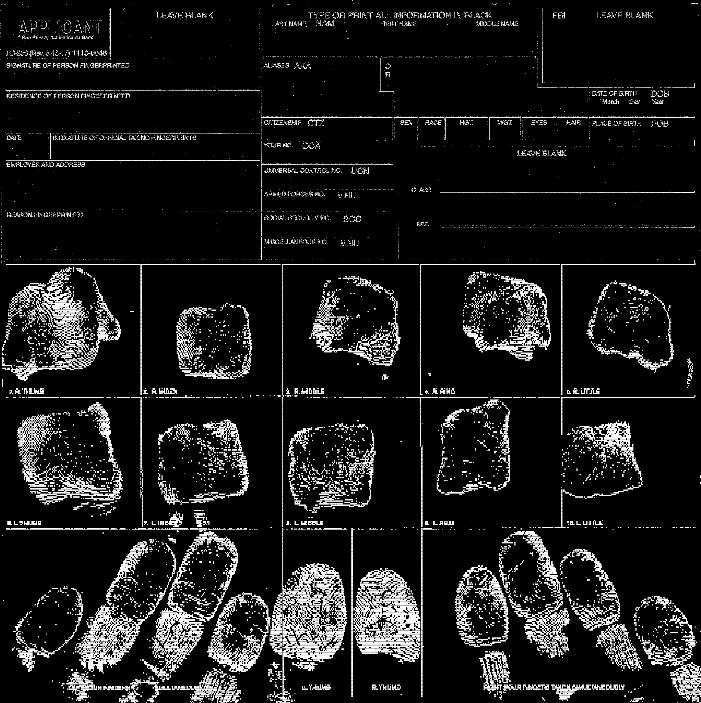
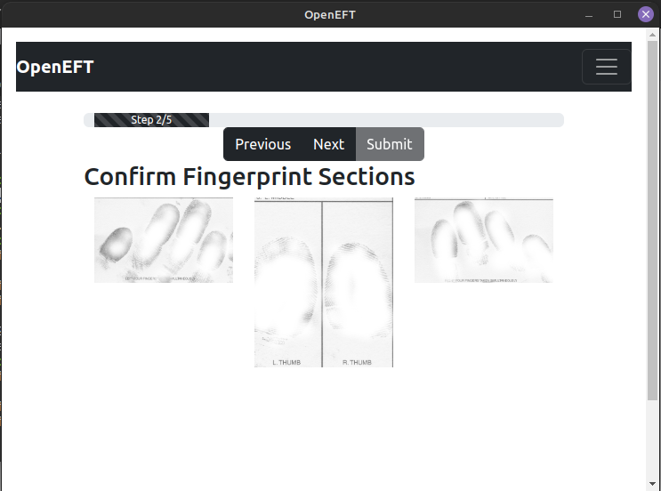
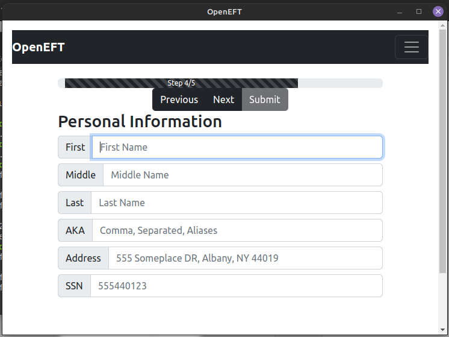
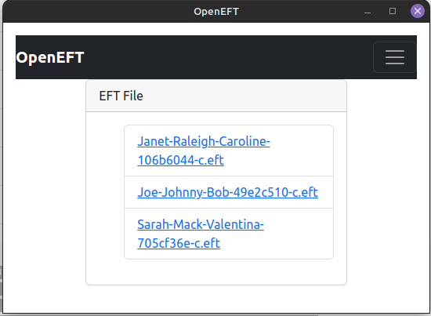
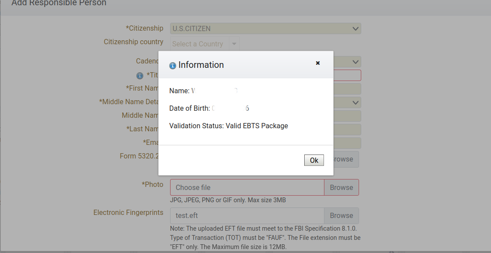

# OpenEFT
OpenEFT is an open-source project created because the ATF are incompetent at best and maliciously trying to thwart civil rights at worst.

Like the project? Consider sponsoring me so I can continue to develop these free tools!

[](https://github.com/sponsors/NoahGWood)



So, if you're here, you probably need to file a Form 1 and would like to file electronically so that it doesn't take 8 months for the ATF to lose your paper fingerprint card, only to find the fingerprinting companies have jacked their prices up to extortionate amounts.

If you're not up for compiling and installing software to DIY, I have created a generation service that you can use at [OpenEFT.org](https://www.openeft.org/eft)

## How To Use

1. Print off FD-258 card (Use the provided template in the repo for best results)

2. Add fingerprints to form (you don't need to fill out the boxes)

3. Take a high-resolution **1:1** scan or picture of the completed FD-258 card.

4. If you don't have it installed, install [Docker Desktop](https://docs.docker.com/desktop/)

5. Run the docker build program from the command line like so:

    *preferred method*
   ```bash
   docker pull kouroshmobl/openeft
   docker run -p 8080:8080 kouroshmobl/openeft
   ```
   OR
   ```bash
   docker build -t openeft:latest .
   docker run -p 8080:8080 openeft
   ```
  

7. Browse to http://localhost:8080
  
8. Follow the instructions the program provides and respond to the prompts with your info.

9. ??? (programming magic happens here, just relax)

10. Congratulations! You now have an EFT!

## Tips

#### How To Record Fingerprints

If you've never had your fingerprints taken, you definitely need to know how to do it. The first ten prints should be "rolled" on as the video demonstrates, then you need to take two "slap" impressions of the four fingers on each hand and two flat impressions of the thumbs.

[](//www.youtube.com/watch?v=47YLGj_yLVA "Fingerprinting Technique")

#### Bad Fingerprints

If you mess up on a fingerprint, you can use a white address label within the blue or black bounding boxes to re-ink that specific finger so you don't need to waste multiple cards. You're not *supposed* to use white out, it could be rejected by the ATF/FBI, but if you're willing to try it let us know if it works! 

#### External Libraries

* [OpenJPEG](https://github.com/uclouvain/openjpeg)
* [NBIS](https://www.nist.gov/services-resources/software/nist-biometric-image-software-nbis) (Need to build from scratch for now until a proper installer is created)

#### Python Modules

* [OpenCV-Python](https://github.com/opencv/opencv-python)
* [Imutils](https://github.com/PyImageSearch/imutils)
* [Pillow](https://python-pillow.org/)
* [NumPy](https:://numpy.org)
* django

## ScreenShots









