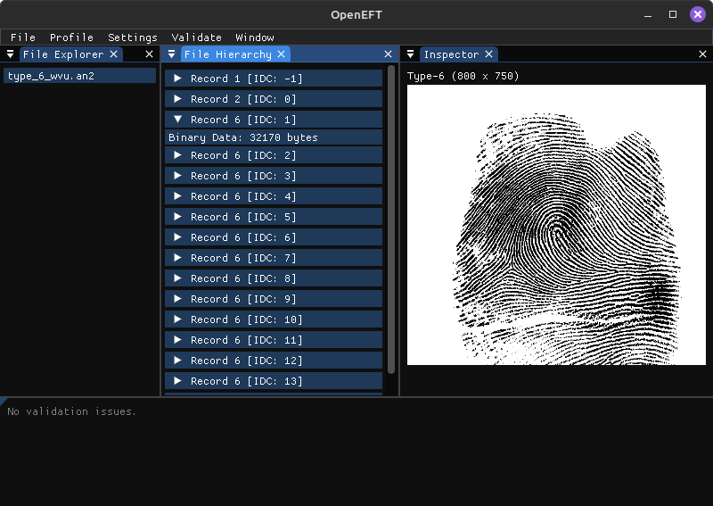

# OpenEFT v2.0
OpenEFT is a cross-platform desktop application for viewing, editing, and validating ANSI/NIST (EBTS) biometric transactions.

Built for real-world workflows involving law-enforcement, government agencies, and biometric data processing.

## Features
- Open & Inspect `.an2`/`.eft` files
- Rules-based validator (EBTS constraints)
- Structured record/field/subfield inspection
- Binary data rendering (works for most fingerprints/images/signatures, including legacy formats)
- Extensible rules engine (agency specific profiles, a great spot to contribute!)
- Native performance (Built on top of NMTK, a high-performance app platform)
## Screenshot



## Architecture

- Language: C++23
- UI: Dear ImGui + OpenGL (via NMTK)
- Core Design: Event-driven + command pattern
- Validation: Rules engine modeled after EBTS specification
- Binary Support: 
    - WSQ (NBIS)
    - JPEG2000 (OpenJPEG)
    - TIFF (libtiff)
    - RAW (NMTK)
## Dependencies
- NBIS (WSQ + biometrics tooling, prebuilt)
- OpenJPEG (JP2K)
- libtiff
- NMTK (Custom UI framework)
- nlohmann/json

## Building
Don't even try to do this manually just run `build.sh`, pray, and call it a day.

## Running
### Linux Native
```
./release/linux/OpenEFT
```
### Linux WINE
```
wine release/windows/OpenEFT.exe
```
### Windows
Just double click `release/windows/OpenEFT.exe`

## Design Goals
- No cloud/SaaS dependencies
- Deterministic Validation Logic
- Extensible Rule System (agency-specific customization)
- Maintainable, Inspectable Data Structures
- High-Performance, Native UI

## Status
### Active Development (MVP stage)

Current capabilities:
- [x] File Loading/Parsing
- [x] Record inspection UI
- [x] Binary rendering (fingerprints/images)
- [-] Validation engine (partial)
- [-] Rule editor (partial)

## Roadmap
- [ ] Rule Editor UI
- [ ] Transaction Builder Wizard
- [ ] NFIQ2 Quality Scoring
- [ ] Export/Reporting tools

## Disclaimer
This tool is intended for development, research, and operational support workflows involving biometric data. Ensure compliance with applicable laws and regulations when handling biometric information.

## License
TBD