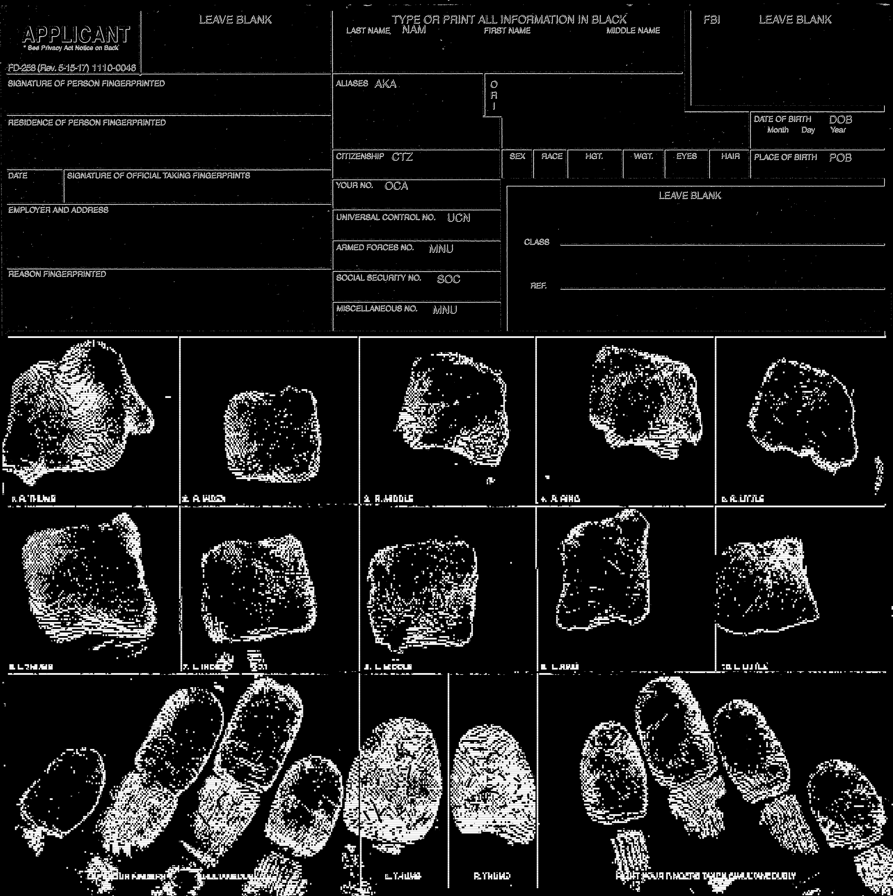
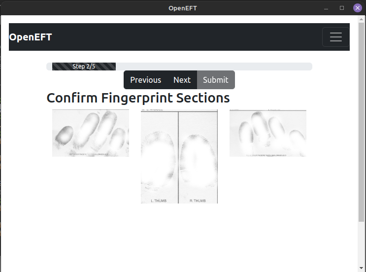
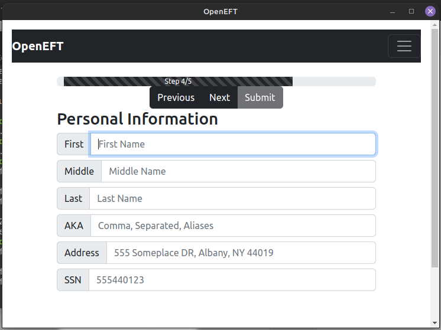
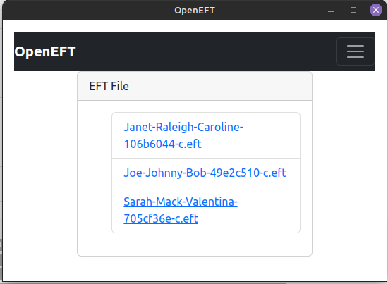
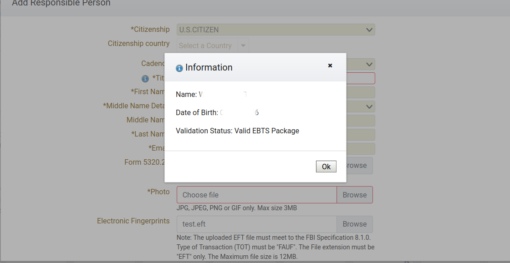

# OpenEFT (2026 Status: DEPRECATED)

**⚠️ ATTENTION AS OF JANUARY 1, 2026, THIS CODEBASE IS OBSOLETE.**
The "One Big Beautiful Bill" (OBBB Act) and the resulting ATF eForms system overhaul have fundamentally changed validation rules for EFT files.

**The current Docker/Python build will likely result in a GUARANTEED DENIAL of your application.**

## Current Status: Rebuilding for Compliance

The legacy Python/Docker version of OpenEFT was rendered non-compliant by the Jan 1, 2026 system purge. We are currently in the middle of a ground-up C++ Rewrite to meet the new federal standards.

## Change Info

### **Why you cannot use the current version:**

- **The 12MB Wall:** The new ATF validator strictly enforces a 12MB limit. The legacy code generates files (often 16MB+) that the system will auto-reject.
- **Missing Box Rejections:** The new 2026 validator will auto-disapprove any EFT missing the 10 individual rolled impressions (Boxes 1-10). The legacy segmentation logic is currently failing on these boxes.
- **EBTS 11.3 Update:** The FBI updated the Electronic Biometric Transmission Specification. Legacy headers are no longer valid for $0 tax stamp submissions.
- **Legislation:** The OBBB Act changed the "Reason for Fingerprinting" (RFP) codes. Using the old codes will flag your $0 application for a $200 payment that doesn't exist, locking your form in "Pending" limbo.

### **Why the Rewrite is Security-Critical (2026 Guidance)**

The rise of Generative AI has created new vulnerabilities in the federal background check system. As a project dedicated to civil rights, OpenEFT must also be a guardian of **Biometric Integrity**.

- **Anti-Injection Standards:** The FBI and ATF are moving toward standards that detect when a biometric stream has been "injected" (bypassing a physical sensor). The C++ rewrite will include Hardware Attestation logic to verify that fingerprints originate from a physical scanner, not a script.
- **Synthetic Fingerprint Detection:** AI can now generate "perfect" fingerprints that bypass traditional filters. We are integrating local Presentation Attack Detection (PAD) to ensure that every EFT generated by this tool is biological and authentic.
- **DOJ Bulk Data Compliance:** As of April 2025, the DOJ has implemented strict rules (28 CFR Part 202) regarding the handling of bulk sensitive personal data. By moving to a local-only, compiled C++ engine, we ensure that user data never crosses a network, mitigating the risk of AI-driven data harvesting or synthetic identity theft.

## 🛠 2026 Roadmap (Q1 Goal)

I am currently free (post-grad life!) and working on a hardened C++ Compliance Engine. The new version will feature:

- **Native WSQ Compression:** Linking directly to NIST NBIS for 15:1 compression (getting that 16MB file down to ~1.2MB).
- **Adaptive NIST Segmentation:** Using NFSEG to find all 10 fingers even on messy/crooked home scans.
- **Type-10 Integration:** Embedding your passport photo inside the EFT for "Fast Track" (3-5 day) approvals.
- **Liveness Detection:** A local classifier trained on NIST datasets to ensure your prints aren't flagged as "AI-Generated" by automated NGI systems. 

## Historical Info (For Reference Only DO NOT USE)

OpenEFT is an open-source project created because the ATF are incompetent at best and maliciously trying to thwart civil rights at worst.

Like the project? Consider sponsoring me so I can continue to develop these free tools!

[](https://github.com/sponsors/NoahGWood)



So, if you're here, you probably need to file a Form 1 and would like to file electronically so that it doesn't take 8 months for the ATF to lose your paper fingerprint card, only to find the fingerprinting companies have jacked their prices up to extortionate amounts.

## How To Use

1. Print off FD-258 card (Use the provided template in the repo for best results)

2. Add fingerprints to form (you don't need to fill out the boxes)

3. Take a high-resolution **1:1** scan or picture of the completed FD-258 card.

4. If you don't have it installed, install [Docker Desktop](https://docs.docker.com/desktop/)

5. Run the docker build program from the command line like so:

   *preferred method*

   ```bash
   docker pull kouroshmobl/openeft
   docker run -p 8080:8080 kouroshmobl/openeft
   ```

   OR

   ```bash
   docker build -t openeft:latest .
   docker run -p 8080:8080 openeft
   ```


7. Browse to http://localhost:8080

8. Follow the instructions the program provides and respond to the prompts with your info.

9. ??? (programming magic happens here, just relax)

10. Congratulations! You now have an EFT!

## Tips

#### How To Record Fingerprints

If you've never had your fingerprints taken, you definitely need to know how to do it. The first ten prints should be "rolled" on as the video demonstrates, then you need to take two "slap" impressions of the four fingers on each hand and two flat impressions of the thumbs.

[](//www.youtube.com/watch?v=47YLGj_yLVA "Fingerprinting Technique")

#### Bad Fingerprints

If you mess up on a fingerprint, you can use a white address label within the blue or black bounding boxes to re-ink that specific finger so you don't need to waste multiple cards. You're not *supposed* to use white out, it could be rejected by the ATF/FBI, but if you're willing to try it let us know if it works! 

#### External Libraries

* [OpenJPEG](https://github.com/uclouvain/openjpeg)
* [NBIS](https://www.nist.gov/services-resources/software/nist-biometric-image-software-nbis) (Need to build from scratch for now until a proper installer is created)

#### Python Modules

* [OpenCV-Python](https://github.com/opencv/opencv-python)
* [Imutils](https://github.com/PyImageSearch/imutils)
* [Pillow](https://python-pillow.org/)
* [NumPy](https:://numpy.org)
* django

## ScreenShots









